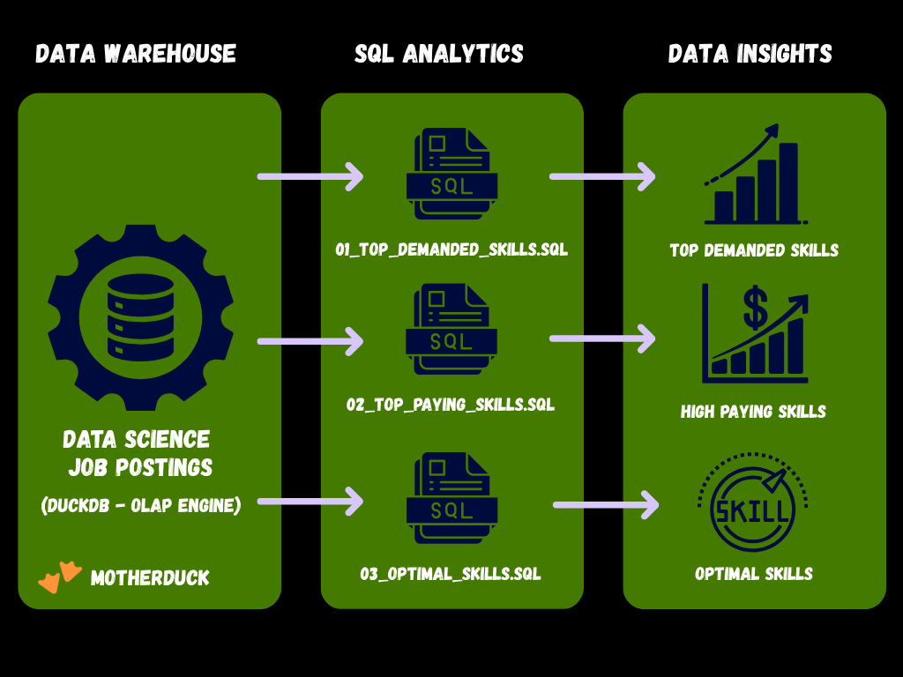
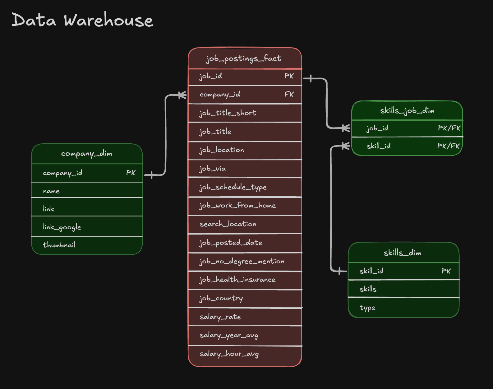

# 📈SQL Analysis: Data Job Market Analytics

Real-world SQL analysis of the data engineering job market - **translating raw job posting data into actionable insights through production-quality queries and business-driven problem framing**.

## 📝Objective (For Hiring Managers)
☑️ Scope - Developed 3 analytical queries addressing key questions about the data engineering job market  
☑️ Data modeling - Joined fact and dimension tables to build a clean, query-ready foundation for analysis  
☑️ Analytics - Used aggregations, filtering, and sorting logic to find top skills by demand, salary, and overall value  
☑️ Outcomes - Uncovered actionable insights around SQL/Python dominance, emerging cloud trends, and compensation patterns

If you only have a minute, please review these:

[01_top_demanded_skills](01_top_demanded_skills.sql) - Demand analysis with multi-table joins  
[02_top_paying_skills](02_top_paying_skills.sql) - Salary analysis with aggregations  
[03_optimal_skills](03_optimal_skills.sql) - Combined demand/salary optimization query

## ❓Problem & Context

Job market analysts need to answer questions like:

🏢 What skills do employers ask for most in data engineering roles?  
💵 Which technical skills translate into the highest salaries?  
⚖️ What's the optimal skill set when weighing both demand and earning potential?

This project analyzes a **data warehouse** built using a star schema design. The warehouse structure consists of:

👉**Fact Table**: `job_postings_fact` - Base table containing job posting details (job titles, locations, salaries, dates, etc.)  

👉**Dimension Tables**:    
- `company_dim` - Company information linked to job postings
- `skills_dim` - Skills catalog with skill names and types 

👉**Bridge Table**: `skills_job_dim` - Resolves the many-to-many relationship between job postings and skills

Joining across relational tables, I extracted meaningful patterns - identifying which skills are most in demand, which drive the highest salaries, and which combinations offer the best overall return for data engineers.  

## 🧰Tech Stack
📍 **Query Engine**: DuckDB for fast OLAP-style analytical queries  
📍 **Language**: SQL (ANSI-style with analytical functions)  
📍 **Data Model**: Star schema with fact + dimension + bridge tables  
📍 **Development**: VS Code for SQL editing + Terminal for DuckDB CLI  
📍 **Version Control**: Git/GitHub for versioned SQL scripts

## 📊Analysis Overview
🧱 **Query Structure**  
1. [Top Demanded Skills](.\01_top_demanded_skills.sql) – Identifies the 10 most in-demand skills for remote data engineer positions  
2. [Top Paying Skills](.\02_top_paying_skills.sql) – Analyzes the 25 highest-paying skills with salary and demand metrics  
3. [Optimal Skills](.\03_optimal_skills.sql) – Calculates an optimal score using natural log of demand combined with median salary to identify the most valuable skills to learn  

💡**Key Insights**  
- SQL and Python are the clear foundations of the field, each appearing in roughly 29,000 job postings.
- Cloud fluency - particularly AWS and Azure - has become a baseline expectation for modern roles.
- Infrastructure tools like Kubernetes, Docker, and Terraform signal seniority and tend to command higher salaries, while Apache Spark remains a high-value skill with both strong demand and strong pay.

## 👨‍💻SQL Skills Demonstrated

### **Query Design & Optimization**

- **Joins**  - `INNER JOIN` across `job_postings_fact`, `skills_job_dim`, and `skills_dim` to link postings with skill metadata  
- **Aggregations** - `COUNT()`, `MEDIAN()`, and `ROUND()` for statistical summarization across skill groups
- **Filtering** - `WHERE` clauses with compound boolean logic across fields like job_title_short, job_work_from_home, and salary_year_avg
- **Sorting & limiting** - `ORDER BY DESC` with `LIMIT` for clean top-N output

### **Data Analysis Techniques**

- **Grouping** - `GROUP BY` for per-skill categorical breakdowns  
- **Log transformation** - `LN()` applied to demand counts to normalize skewed distributions before scoring  
- **Composite scoring** - Derived metric combining log-transformed demand and median salary to rank overall skill value  
- **Aggregate filtering** - `HAVING` clause to exclude low-signal skills with fewer than 100 postings  
- **NULL handling** - Explicit `IS NOT NULL` filtering to ensure salary calculations use only complete records  
