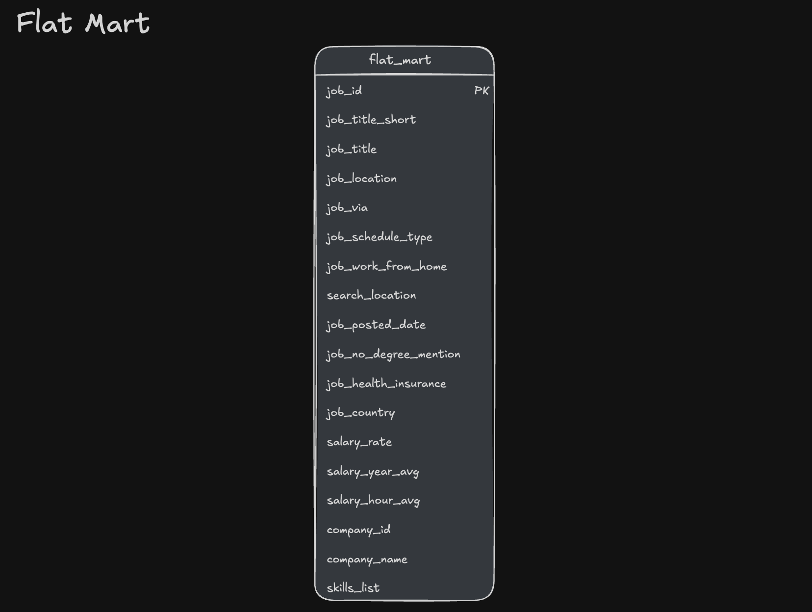

# 🏪Data Warehouse & Mart Build: Production ETL Pipeline

## 📖Overview 
This project walks through building a complete data engineering pipeline - from raw CSV files in Google Cloud Storage to a normalized star schema data warehouse, culminating in analytical data marts for BI and reporting.

## 🗂️Project Objectives
☑️ **Pipeline scope:** Built a complete ETL pipeline from raw CSVs to star schema warehouse to analytical marts  
☑️ **Data modeling:** Designed a star schema with fact tables, dimensions, and bridge tables for many-to-many relationships  
☑️ **ETL development:** Implemented extract, transform, load processes with idempotent operations and data quality checks  
☑️ **Mart architecture:** Created specialized data marts (flat, skills, priority) with additive measures and incremental update patterns

## ❓Problem & Context

**The Problem**  

Raw job posting data lands as flat CSV files in Google Cloud Storage - unstructured and not built for analytical queries. Business questions like these can't be answered reliably without a proper data foundation:

- Which skills are most in demand, and how is that shifting over time?  
- What do hiring trends look like by company and location?  
- How do salaries vary across roles and skill sets?

Without a single source of truth, analysis becomes inconsistent and hard to scale. And for high-frequency queries - skill demand breakdowns, priority role tracking, flat reporting - running directly against raw data is slow and expensive.  

**The Solution**

An end-to-end ETL pipeline that pulls CSVs from Google Cloud Storage, normalizes them into a star schema data warehouse (separating facts from dimensions), and builds three specialized data marts optimized for distinct use cases: flat queries, skill demand analysis, and priority role tracking.

## 🧰Tech Stack
📌**Database:** DuckDB (file-based OLAP database with GCS integration via `httpfs`)  
📌**Language**: SQL (DDL for schema design, DML for data loading and transformation)  
📌**Data Model**: Star schema with fact + dimension + bridge tables  
📌**Development**: VS Code for SQL editing + Terminal for DuckDB CLI  
📌**Automation:** Master SQL script for pipeline orchestration  
📌**Version Control**: Git/GitHub for versioned SQL scripts  
📌**Storage:** Google Cloud Storage for source CSV files

## 📂Repository Structure

```Text
2_WH_Mart_Build/
├── 01_create_tables_dw.sql             # Star Schema DDL
├── 02_load_schema_dw.sql               # GCS Data Extraction & Loading
├── 03_create_flat_mart.sql             # Denormalized Flat Mart
├── 04_create_skills_mart.sql           # Skills Demand Mart
├── 05_create_priority_mart.sql         # Priority Roles Mart
├── 06_update_priority_mart.sql         # Priority Mart Incremental Update (MERGE)
├── build_dw_marts.sql                  # Master SQL Build Script
└── README.md                           #📍You Are Here 
```

## 🧱Pipeline Architecture  
Raw job posting CSVs from Google Cloud Storage flow through a normalized star schema warehouse and into specialized analytical data marts, ready for consumption by BI tools like Excel, Power BI, Tableau, and Python.


### Data Warehouse
The data warehouse implements a star schema with `company_dim`, `skills_dim`, `job_postings_fact`, and `skills_job_dim` tables


- **SQL Files:**
  - [`01_create_tables_dw.sql`](./01_create_tables_dw.sql) 
  - [`02_load_schema_dw.sql`](./02_load_schema_dw.sql) 
- **Purpose:** Extracts CSVs from GCS and loads them into a star schema warehouse - the single source of truth for all analytical queries
- **Grain:** One row per job posting in the fact table (`job_postings_fact`)

### Flat Mart
Denormalized wide table pre-joining all dimensions



- **SQL File:** [`03_create_flat_mart.sql`](./03_create_flat_mart.sql)
- **Purpose:** Denormalized table for quick ad-hoc analysis
- **Grain:** One row per job posting with all dimensions joined

### Skills Mart
Skill demand trends over time, powered by pre-aggregated additive measures


- **SQL File:** [`04_create_skills_mart.sql`](./04_create_skills_mart.sql) 
- **Purpose:** Time-series analysis of skill demand over time with additive measures
- **Grain:** `skill_id + month_start_date + job_title_short`
- **Key Features:** Additive measures throughout (counts and sums) - safe to re-aggregate at any grain

### Priority Mart
Priority role tracking with incremental updates using MERGE operations


- **SQL Files:**
  - [`05_create_priority_mart.sql`](./05_create_priority_mart.sql) 
  - [`06_update_priority_mart.sql`](./06_update_priority_mart.sql)
- **Purpose:** Initial full load of priority roles and job snapshots, refreshed incrementally via MERGE upserts to keep data current
- **Grain:** One row per job posting with priority level assignment
- **Key Features:** **MERGE operations for incremental updates** - demonstrates production-ready upsert patterns (`INSERT`, `UPDATE`, `DELETE` in single statement)

## 👨‍💻Data Engineering Skills Demonstrated

### ETL Pipeline Development

- **Extract:** Direct CSV loading from Google Cloud Storage using DuckDB's `httpfs` extension  
- **Transform:** Data normalization, type conversion (`CAST`, `DATE_TRUNC`), and quality filtering  
- **Load:** Idempotent table creation with `DROP TABLE IF EXISTS` patterns  
- **Incremental Updates:** MERGE operations for upsert patterns (`INSERT`, `UPDATE`, `DELETE` in single statement)  
- **Orchestration:** Master SQL script (`build_dw_marts.sql`) for automated pipeline execution  

### Dimensional Modeling

- **Star Schema Design:** Fact table (`job_postings_fact`) with dimension tables (`company_dim`, `skills_dim`)  
- **Bridge Table:** Many-to-many relationship handling (`skills_job_dim`)  
- **Grain Definition:** Proper fact table granularity (skill + month, company + title + location + month)  
- **Additive Measures:** Counts and sums that can be safely re-aggregated at any level  

### SQL Advanced Techniques

- **DDL Operations:** `CREATE TABLE`, `DROP TABLE`, `CREATE SCHEMA` for schema management  
- **DML Operations:** `INSERT INTO ... SELECT` with explicit column mapping from CSV sources  
- **MERGE Operations:** Incremental updates using `MERGE INTO` with `WHEN MATCHED`, `WHEN NOT MATCHED`, and `WHEN NOT MATCHED BY SOURCE` clauses for production-ready upsert patterns  
- **CTEs:** Common Table Expressions for complex transformations and boolean flag conversions  
- **Date Functions:** `DATE_TRUNC()`, `EXTRACT()` for temporal dimension creation  
- **String Functions:** `STRING_AGG` for concatenation, `REPLACE` for data cleaning  
- **Boolean Logic:** `CASE WHEN` conversions for aggregating flags (remote, health insurance, no degree)  

### Data Quality & Production Practices

- **Idempotency:** Scripts are designed to be rerunnable, producing the same result on every execution  
- **Data Validation:** Verification queries at each pipeline step to ensure data integrity  
- **Type Safety:** Proper data type definitions (`VARCHAR`, `INTEGER`, `DOUBLE`, `BOOLEAN`, `TIMESTAMP`)  
- **Schema Organization:** Separate schemas (`flat_mart`, `skills_mart`, `priority_mart`) for logical separation  
- **Error Handling:** Structured script execution with clear error messages and progress reporting  
